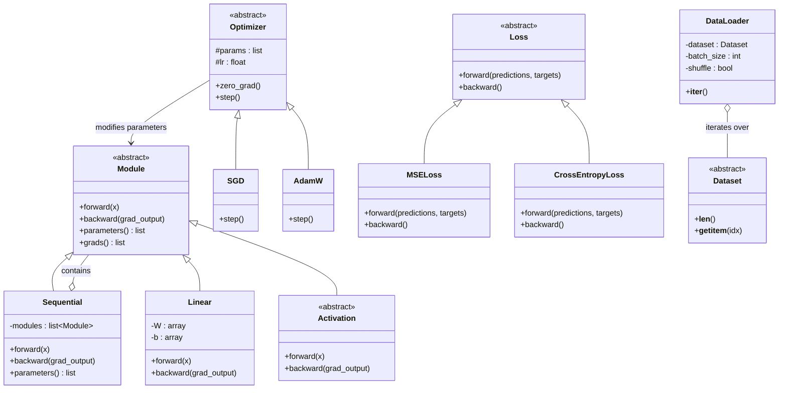

# Mini-Torch Framework Specification

This document outlines the  architecture for a "Mini-Torch" framework, designed for computer science students building neural networks from scratch. It mirrors the PyTorch API using only `numpy`, `matplotlib`, select elements of `scipy`, and standard Python, emphasizing manual gradient calculations and batch-first row-vector notation. 

To improve encapsulation and modularity, this framework incorporates the following major architectural elements: an `Optimizer` base class (parameter updating), a `Loss` base class (error and initial gradient calculation, a `Dataset`/`DataLoader` pipeline (base classes to structure and iterate through data), a `Module` base class (layers, forward and backward passes), and a `Sequential` container (`Module` subclass that manages chaining of multiple layers).

## Core Philosophy

To bridge the gap between foundational mathematics and the modern architecture of Generative AI (LLMs, GANs), this course utilizes a **"Mini-Torch" Framework**.

* **Foundations:** We implement algorithms "from scratch" to understand the mechanics.  
* **Modern Structure:** We use **Row-Vector (Batch-First)** notation. This deviates from the *Neural Network Design* textbooks (which use column vectors) but aligns with modern GenAI papers and libraries (PyTorch, TensorFlow, JAX).  
* **No Black Boxes:** We do not use autograd engines (like `torch.autograd`). We calculate gradients manually.

## Allowable Libraries

* **Required:** `numpy` (Standard array operations), `matplotlib` (Visualization).  
* **Allowed for Efficiency:** `scipy.special` (Specifically `expit` for Sigmoid, softmax).  
* **Prohibited:** torch, tensorflow, keras, sklearn.neural_network.

## Object-Oriented Principles and Design Patterns

The revised architecture relies heavily on established software design patterns to ensure the framework is modular, scalable, and easy to maintain.

*   **Single Responsibility Principle (SRP):** Forward propagation and gradient management concerns are separated. `Module` strictly handles the model's state and mathematical operations, while the `Optimizer` class takes responsibility for parameter updates. Data fetching and batching are delegated to the `Dataset` and `DataLoader` classes.
*   **Composite Pattern (Structural):** The Composite pattern allows a tree structure of simple and composite objects to be treated uniformly. The `Sequential` class implements this by inheriting from the base `Module` while simultaneously acting as a container for a list of other `Module` instances (like `Linear` or `ReLU`). Calling `forward()` on a `Sequential` object automatically propagates the input through all contained modules.
*   **Strategy Pattern (Behavioral):** The Strategy pattern encapsulates interchangeable algorithms inside a class. 
    *   The **`Optimizer`** base class serves as a strategy for weight updates. Students can implement and swap `SGD` for `AdamW`, for example, without altering the model architecture.
    *   The **`Loss`** base class serves as a strategy for error calculation, allowing students to implement and seamlessly switch between `MSELoss` (for regression) and `CrossEntropyLoss` (for classification), for example.
*   **Iterator Pattern (Behavioral):** The Iterator pattern provides sequential access to elements of a collection. The `DataLoader` acts as an iterable wrapper around a `Dataset` object, managing complex data flows, minibatches, and shuffling without exposing the underlying dataset structure.

Using these patterns means that it is possible to first implement simplified versions of many of these classes, later adding more elaborated version without needing to change other classes.

## UML Framework Architecture

## Core Component Specifications

### The Neural Network Hierarchy (`Module`, `Sequential`, and `Activation`)
The `Module` base class is the foundational building block of the neural network. Every layer ([detailed information](Layer.md)) must implement an `__init__()`, `forward(x)`, and a `backward(grad_output)` method:
* `__init__(self, ...)`: This method is strictly required. It must call `super().__init__()` and is used to define and register the internal layers and parameters the module will use. Parameters will depend on whether the subclass implements a single layer or is a container.
* `forward(self, x)`: The method where the forward pass computation (how input `x` flows through the layer(s) defined in `__init__()`) is explicitly specified.
* `backward(self, grad_output)`: The method where the backward pass (computation of parameter and input gradients from output gradients) is specified.

#### `Sequential` Container ([detailed information](Container.md))
* Subclasses `Module` and takes a list of `Module`s during initialization. Its `forward` method loops through the list, passing the output of one layer as the input to the next. Its `backward` method loops through the list in reverse, applying the chain rule. 
*   **Parameter Management:** The `Sequential` module recursively collects and returns the output of `parameters()` and `grads()` from all of its child modules, enabling the optimizer to update the entire network at once.

#### `Activation` Layer  ([detailed information](Activation.md))
The `Activation` abstract class specializes the `Module` interface to act as a blueprint for **parameter-free, non-linear transformations**, such as ReLU, Sigmoid, or GELU. Because an activation layer's sole purpose is to apply a mathematical function element-wise to the outputs of a preceding linear layer, its implementation of the `Module` interface is specialized in the following ways:
*   **No Trainable Parameters:** Unlike a layer of "neurons", an activation function does not contain any learnable weights or biases. Consequently, an `Activation` subclass specializes the interface by having its `parameters()` and `grads()` methods simply return empty lists `[]` (or by relying on a base `Module` implementation that defaults to returning empty lists).
*   **Simplified `__init__()`:** The constructor does not need to initialize matrices for weights and biases, nor does it need placeholders for parameter gradients (`self.dW`, `self.db`). It only needs to set up a state variable (e.g., `self.x = None`) to cache the input data for the backward pass.
*   **Element-wise `forward(x)`:** The forward pass applies its specific non-linear equation across the input array. For example, a ReLU subclass would threshold all negative inputs to 0, while a GELU subclass would apply a smooth, non-linear approximation. It caches the input `x` and returns the transformed array.
*   **Input-Only `backward(grad_output)`:** Because there are no internal weights to optimize, the backward pass skips parameter gradient calculations entirely. Instead, it computes the local derivative of the activation function evaluated at the cached input `x`, multiplies this element-wise by the incoming `grad_output` (applying the chain rule), and returns the resulting `grad_input` to be passed to the preceding layer.

### The Optimization Engine (`Optimizer`) ([detailed information](Optimizer.md)) 
The `Optimizer` base class handles mathematical optimization of model parameters.
*   **Initialization:** Takes an iterable list of references to the model's learnable parameters and a learning rate (e.g., `lr=0.01`).
*   **`zero_grad()`:** Iterates through the stored parameters and clears their gradients (sets them to zero) before each training step to prevent unintended gradient accumulation.
*   **`step()`:** Iterates through the parameters and their calculated gradients, applying the specific update algorithm (such as Stochastic Gradient Descent).

### The Error Calculation (`Loss`) ([detailed information](Loss.md)) 
Loss functions quantify the difference between model predictions and target values and initiate the backpropagation process.
*   **`forward(predictions, targets)`:** Returns a scalar measure of the error (e.g., Mean Squared Error or Cross-Entropy).
*   **`backward()`:** Computes the initial loss gradient with respect to the network's predictions. This output is then passed directly into the final `Module`'s `backward(grad_output)` method.

###  Management (`Dataset` and `DataLoader`)
These classes separate data handling logic from the main training loop.
*   **`Dataset` Base Class:** ([detailed information](Dataset.md)) An abstract class requiring students to implement two python "magic" methods: `__len__(self)` to return the total number of samples, and `__getitem__(self, index)` to retrieve a single `(x, y)` data sample and label at a specific index.
*   **`DataLoader`:** ([detailed information](DataLoader.md)) Wraps the `Dataset` and acts as a Python generator/iterator. It groups individual samples into `numpy` arrays (minibatches) and handles dataset shuffling at the start of each epoch.

## The Standard Training Loop
With the revised architecture, students will implement a clean training loop that perfectly maps to the standard PyTorch workflow:

1.  Iterate over epochs.
2.  Iterate over batches yielded by the `DataLoader`.
3.  **Forward Pass:** Pass the batch through the `Sequential` model to generate predictions.
4.  **Loss Calculation:** Pass predictions and targets to the `Loss` object's `forward` method.
5.  **Zero Gradients:** Call `optimizer.zero_grad()`.
6.  **Backward Pass:** Call `loss.backward()` to get the initial gradient, then pass it to `model.backward(grad_output)` to calculate all internal gradients.
7.  **Parameter Update:** Call `optimizer.step()` to adjust the weights.

## Important References and Further Reading

*The following resources are highly recommended for students to deepen their understanding of the design patterns and architectural concepts used in this framework.*

*   [Introduction to PyTorch (Raschka)][ref_raschka_appendix_a]: A comprehensive primer on PyTorch tensors, autograd, and the standard training loop.
*   [PyTorch Data Structures (Official)][ref_pytorch_data]: Official guide on `torch.utils.data.Dataset` and `DataLoader`.
*   [PyTorch Neural Network Architecture][ref_pytorch_nn]: Deep dive into `nn.Module` and the `Sequential` container.
*   [Software Design Patterns Overview][ref_design_patterns]: A summary of Creational, Structural, and Behavioral design patterns (including Composite, Strategy, and Iterator).
*   [Neural Network Design: Deep Learning][ref_hagan_nndeep]: Foundational text covering multilayer network training, gradients, and optimization (Chapters 2 & 3).

[//]: # (URL References for Canvas LMS Integration - Update these links as needed before publishing)
[ref_raschka_appendix_a]: https://github.com/rasbt/LLMs-from-scratch/blob/main/appendix-A
[ref_pytorch_data]: https://pytorch.org/tutorials/beginner/basics/data_tutorial.html
[ref_pytorch_nn]: https://pytorch.org/guide/keras/sequential_model
[ref_design_patterns]: https://refactoring.guru/design-patterns
[ref_hagan_nndeep]: https://github.com/NNDesignDeepLearning/NNDesignDeepLearning
