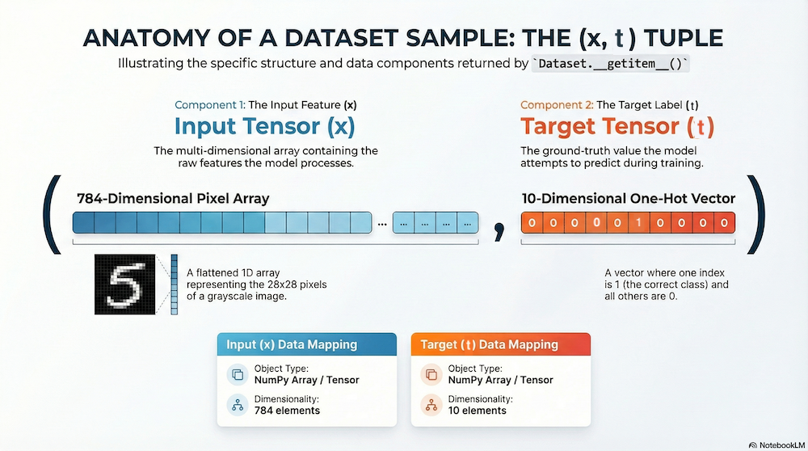

# Example code

Example implementation and test code for the Mini-Torch Framework.

## MNIST Dataset

Two Python files are provided: `MNISTDataset.py`, which loads and provides access to MNIST-formatted (CSV) data, and `dataset_test.py`, which performs a basic test of that class. An element of the dataset returned by the `__getitem__()` method is described by the figure below:

